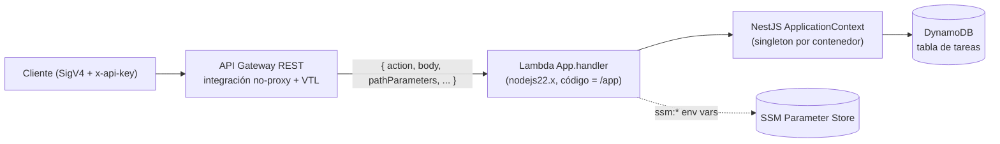
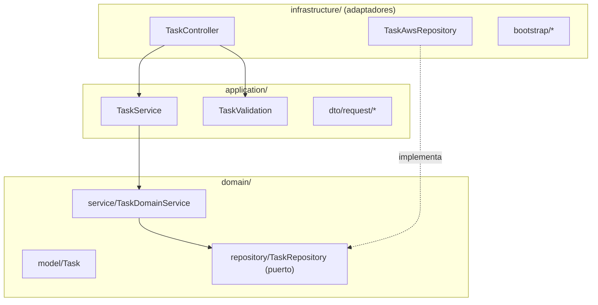
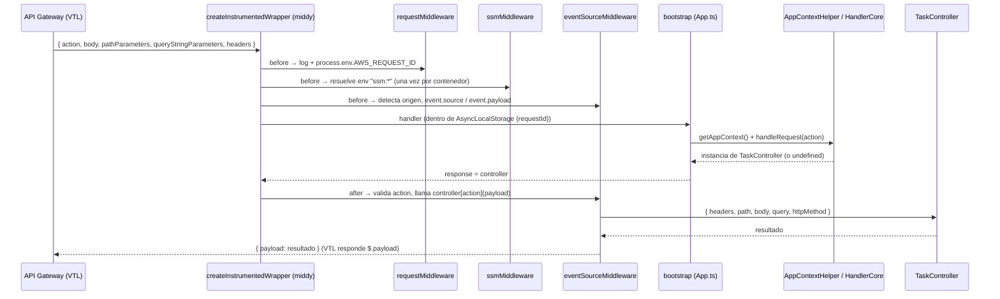

# Arquitectura y Diseño Técnico

Este documento describe **cómo funciona realmente** el arquetipo: capas, flujo de una invocación de punta a punta, decisiones de diseño (y sus trade-offs) y la guía para agregar un dominio nuevo. Para comandos y setup ver [README.md](README.md); para la biblioteca CDK ver [infrastructure/README.md](infrastructure/README.md).

---

## 1. Vista general

Piezas principales:

| Pieza                     | Ubicación                                              | Responsabilidad                                                        |
| ------------------------- | ------------------------------------------------------ | ---------------------------------------------------------------------- |
| Handler Lambda            | `src/task-manager/infrastructure/bootstrap/App.ts`     | Punto de entrada; arma el pipeline middy.                              |
| Wrapper instrumentado     | `src/common/core/lambda-bootstrap.helper.ts`           | Envuelve el handler en `AsyncLocalStorage` y aplica los middlewares.   |
| Middlewares               | `src/common/core/*.middleware.ts`                      | Logging de contexto, resolución SSM, normalización y **despacho**.     |
| Contexto NestJS           | `bootstrap/helpers/AppContextHelper.ts`                | Crea una vez el `ApplicationContext` (DI) y lo reutiliza.              |
| Resolución de controlador | `bootstrap/HandlerCore.ts`                             | Devuelve el `TaskController` si tiene un método llamado como `action`. |
| Dominio de ejemplo        | `src/task-manager/{domain,application,infrastructure}` | CRUD de tareas.                                                        |
| Infraestructura           | `infrastructure/`                                      | Stack CDK + constructores `Template*`.                                 |

---

## 2. Capas (estilo hexagonal)

| Capa                | Contenido real                                                                                                                                                      | Regla                                                                                         |
| ------------------- | ------------------------------------------------------------------------------------------------------------------------------------------------------------------- | --------------------------------------------------------------------------------------------- |
| **Dominio**         | `Task` (interface), `TaskRepository` (puerto), `TaskDomainService` (genera `taskId = task-<timestamp>`, estado inicial `PENDING`)                                   | No importa AWS SDK. Hoy usa el decorador `@Injectable` (re-export de NestJS) por pragmatismo. |
| **Aplicación**      | `TaskService` (orquesta, traduce errores a `CustomException`), `TaskValidation` (manual: `title` obligatorio), DTOs como clases planas                              | No hay `class-validator`; la validación es imperativa.                                        |
| **Infraestructura** | `TaskController` (métodos = acciones), `TaskModule` (DI: `'TaskRepository'` → `TaskAwsRepository`), `TaskAwsRepository` (DynamoDB DocumentClient), bootstrap Lambda | Único lugar donde se toca AWS.                                                                |

La inversión de dependencias se hace con un **token string**: `TaskDomainService` recibe `@Inject('TaskRepository')`, y `TaskModule` decide la implementación concreta. Cambiar a otra persistencia = otro provider, sin tocar el dominio.

Hay además helpers transversales en `src/common/infrastructure/` (`DynamoDbHelper`, `S3Helper`, `HttpHelper`) que el ejemplo **no usa todavía**; están pensados para nuevos repositorios.

---

## 3. Flujo de una invocación (API Gateway → Lambda)

Puntos clave, verificados en el código:

1. **El despacho ocurre en el `after` de `eventSourceMiddleware`**, no en el handler. El handler solo devuelve la instancia del controlador; el middleware invoca `controller[action](payload)` y reemplaza la respuesta por `{ payload: data }`. La plantilla de respuesta de API Gateway (`$input.path("$.payload")`) desempaqueta ese objeto.
2. Si `action` falta o el controlador no tiene ese método se lanza `ValidationException` con `ECORE-0003`.
3. **`requestId`**: el wrapper usa `context.awsRequestId` en `AsyncLocalStorage`; `requestMiddleware` además lo deja en `process.env.AWS_REQUEST_ID`, que el logger usa como respaldo fuera del contexto ALS.
4. **`onError`** (solo origen API Gateway): convierte el error en `{ error: { ...campos, httpStatus } }` con `httpStatus` = `422` para `BusinessException`, `400` para `ValidationException`, o el `httpStatus` propio / `500`. Ver la limitación #2 del README: la integración no-proxy aún no mapea esos errores a códigos HTTP.

### Orígenes de evento soportados por `eventSourceMiddleware`

Orden de detección (el primero que coincide gana):

| Origen         | Condición                                                                                | `event.payload` resultante                                       |
| -------------- | ---------------------------------------------------------------------------------------- | ---------------------------------------------------------------- |
| API Gateway    | `origin === 'API_GATEWAY_REST_EVENT'`, o `action` + `body !== undefined`, o `httpMethod` | `{ body, pathParameters, query, headers, path, method, action }` |
| S3             | `Records[0].eventSource === 'aws:s3'`                                                    | `[{ bucket, key, eventName }]`                                   |
| SNS            | `Records[0].EventSource === 'aws:sns'`                                                   | `[{ message, messageAttributes }]`                               |
| SQS            | `Records[0].eventSource === 'aws:sqs'`                                                   | `[{ messageId, body, attributes }]`                              |
| EventBridge    | existe `detail-type`                                                                     | `event.detail`                                                   |
| Lambda directa | existe `action`                                                                          | `{ action, payload }`                                            |
| Step Functions | _fallback_                                                                               | `{ action, payload }`                                            |

Solo el origen **API Gateway** tiene despacho automático a controlador en el `after`; para el resto, el handler debe consumir `event.payload` por su cuenta. Si el evento ya trae `payload`, el middleware no lo sobrescribe.

### Handler de Step Functions

`bootstrap/Step.ts` es un handler independiente (sin middy ni NestJS DI) que ejecuta `TaskService.processTask()` dentro de `AsyncLocalStorage`. Está como ejemplo; el stack actual no lo despliega.

---

## 4. Decisiones de diseño

| Decisión                                                                   | Motivo                                                                                    | Trade-off                                                                                 |
| -------------------------------------------------------------------------- | ----------------------------------------------------------------------------------------- | ----------------------------------------------------------------------------------------- |
| **`NestFactory.createApplicationContext`** (sin Express/Fastify en Lambda) | Menor peso y arranque; solo se usa la DI de Nest.                                         | No hay decoradores HTTP (`@Get`, `@Body`, pipes, guards); el routing lo hace API Gateway. |
| **Contexto singleton por contenedor** (`AppContextHelper`)                 | Las invocaciones _warm_ reutilizan el grafo de DI; solo el _cold start_ paga la creación. | Estado en memoria compartido entre invocaciones del mismo contenedor.                     |
| **Routing por `action`** inyectada en VTL                                  | Una Lambda por dominio en vez de una por endpoint; menos recursos.                        | La VTL y el mapeo de errores viven en CDK, fuera del código de negocio.                   |
| **Integración no-proxy**                                                   | El handler recibe un contrato propio y estable.                                           | Hay que declarar respuestas de error explícitamente (pendiente).                          |
| **Un único asset `/app`** para todas las Lambdas                           | Build simple y un solo `package.json` de runtime.                                         | Cada Lambda carga todo el código y dependencias del servicio.                             |
| **SDK v3 excluido de `app/`**                                              | El runtime `nodejs22.x` ya lo incluye; paquete más liviano.                               | La versión del SDK en Lambda es la del runtime, no la del lockfile.                       |
| **Constructores `Template*` obligatorios**                                 | Naming, cifrado y retención consistentes.                                                 | Hay que extender la biblioteca cuando se necesita un recurso nuevo.                       |

---

## 5. Logging y excepciones

- `Logger` (`src/common/Logger.ts`) es `CustomLoggerSupport`, también registrado como logger de NestJS. Formato: `timestamp requestId LEVEL - mensaje`.
- Hay **dos** `LogContext.ts` (`src/common/supports/` y `src/common/application/supports/`) con la misma responsabilidad; conviene consolidarlos.
- Jerarquía de errores:
  - `ValidationException`: entrada inválida → `400`.
  - `BusinessException`: regla de negocio → `422`.
  - `CustomException`: error con `code`, `message`, `httpStatus` y `details` explícitos (lo usa `TaskService`).
- Catálogo base `EXCEPTION_CONSTANT` (`ECORE-0001` … `ECORE-0011`): ver [`exceptions.constant.ts`](src/common/core/exceptions.constant.ts).

---

## 6. Desarrollo local vs. AWS

| Aspecto           | `pnpm start:local`                         | AWS                                             |
| ----------------- | ------------------------------------------ | ----------------------------------------------- |
| Entrada           | Express → `controller.metodo(req)` directo | API Gateway → `App.handler` → middy             |
| Middlewares middy | ❌ no se ejecutan                          | ✅                                              |
| Parámetro `{id}`  | `req.params.id`                            | `pathParameters` (ver limitación #1 del README) |
| Errores           | siempre `500`                              | `400` / `422` / `500` vía `onError`             |
| Persistencia      | DynamoDB real (`TASKS_TABLE_NAME`)         | DynamoDB del stack                              |

El servidor local sirve para iterar sobre la lógica de negocio. **No reemplaza** una prueba del handler real (con un evento de ejemplo o `sam local invoke` sobre `cdk.out`).

---

## 7. Guía: agregar un dominio nuevo

Ejemplo con `product`:

1. **Dominio**: `src/product/domain/model/Product.ts`, `repository/ProductRepository.ts` (interface), `service/ProductDomainService.ts` con `@Inject('ProductRepository')`.
2. **Aplicación**: `src/product/application/ProductService.ts`, `dto/request/*`, `validation/ProductValidation.ts`.
3. **Infraestructura**:
   - `repository/ProductAwsRepository.ts` implementa el puerto (puedes reutilizar `DynamoDbHelper`).
   - `controller/ProductController.ts`: un método público por acción (`createProduct(request)`, …).
   - `controller/ProductModule.ts`: registra controller, servicios y `{ provide: 'ProductRepository', useClass: ProductAwsRepository }`.
4. **Bootstrap**: crea `src/product/infrastructure/bootstrap/` (App/HandlerCore/AppContextHelper/AppModule) siguiendo el de `task-manager`. Hoy `HandlerCore` está acoplado a `TaskController`, así que cada dominio tiene su propio bootstrap y su propia Lambda.
5. **Infra CDK**: `infrastructure/lib/module/product/product.infra.ts` con `TemplateTable`, `TemplateLambdaFunction` (handler `src/product/infrastructure/bootstrap/App.handler`) y rutas con `TemplateLambdaIntegration({ action })`; instáncialo en `infrastructure.stack.ts` pasándole la API compartida.
6. **Local** (opcional): `server-local/modules/product.local.ts` exportando `path`, `router`, `initialize`, `cleanup`, `printHelp`.

---

## 👤 Autor

**Ricardo Genaro** · [@ricardogenaro99](https://github.com/ricardogenaro99)
