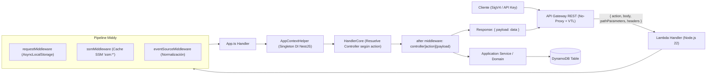

# CONTEXTO MAESTRO — SSOT DE INGENIERÍA
## AWS CDK + NestJS Archetype Template (`aws-cdk-nestjs-archetype-template`)

> **SSOT (Single Source of Truth)** para el arquetipo base y plantilla oficial de microservicios serverless en AWS para **Genaryth** y el ecosistema de **Ricardo Genaro**.  
> **Versión del Arquetipo:** `1.0.0` | **Runtime:** Node.js 22.x | **IaC:** AWS CDK v2 | **DI:** NestJS 11

---

## 1. Resumen Ejecutivo y Propósito

El repositorio `aws-cdk-nestjs-archetype-template` es el **arquetipo maestro de infraestructura y backend serverless** concebido por Ricardo Genaro para Genaryth. Funciona tanto como un microservicio funcional de referencia (`task-manager`) como una plantilla paramétrica de scaffolding compatible con `@ricardogenaro99/scaffolder` (mediante `template.config.json`).

### Objetivos Clave:
1. **Arranque Ultrarrápido:** Reducir a menos de 5 minutos la creación de un nuevo microservicio backend con infraestructura CloudFormation lista para producción.
2. **Cold Starts Mínimos:** Uso exclusivo de `NestFactory.createApplicationContext` (sin adaptadores pesados como Express o Fastify en Lambda), preservando Inyección de Dependencias y Arquitectura Hexagonal con consumo mínimo de memoria.
3. **Gobierno Cloud y Nomenclatura Estricta:** Biblioteca de constructores `Template*` (`TemplateRestApi`, `TemplateLambdaFunction`, `TemplateTable`, etc.) que aplican hashing seguro de identificadores, cifrado obligatorio, políticas de retención de logs escalonadas (`DESA`, `TEST`, `PROD`) y tagging unificado.
4. **Enrutamiento por VTL y Despacho Middy:** Integración API Gateway REST no-proxy mediante Apache Velocity (VTL) que inyecta la acción (`action`) y mapea respuestas vía `eventSourceMiddleware`.

---

## 2. Especificación Arquitectónica (SAD)

### 2.1 Flujo Integral de Invocación



### 2.2 Estructura por Capas (Arquitectura Hexagonal Pragmática)

El código de negocio (`src/[dominio]`) sigue una separación estricta:
- **`domain/`**: Modelos de entidad (`Task`), interfaces de puertos (`TaskRepository`) y servicios de dominio (`TaskDomainService`). Cero acoplamiento a librerías de AWS SDK.
- **`application/`**: Casos de uso (`TaskService`), validaciones de negocio imperativas (`TaskValidation`), DTOs planos y manejo de excepciones de dominio.
- **`infrastructure/`**: 
  - Adaptadores secundarios: Repositorios concretos (`TaskAwsRepository` con `@aws-sdk/lib-dynamodb`).
  - Adaptadores primarios: Controladores (`TaskController` donde cada método corresponde a una `action`).
  - Módulos NestJS (`TaskModule`) con inyección desacoplada vía tokens string (`@Inject('TaskRepository')`).
  - Bootstrap Lambda (`App.ts`, `HandlerCore.ts`, `AppContextHelper.ts`).

### 2.3 Estructura del Proyecto

```text
.
├── .husky/                         # Hooks git: pre-commit (tsc) y commit-msg (commitlint)
├── docs/                           # Documentación SSOT (Fase Kickoff)
│   ├── CONTEXTO_MAESTRO.md         # Este documento (SSOT técnico y funcional)
│   └── OPERATING_THREADS.md        # Catálogo de hilos de Antigravity
├── infrastructure/                 # Workspace pnpm "arq-impl-cdk" (AWS CDK v2)
│   ├── bin/infrastructure.ts       # Entrypoint CDK con carga de variables .env
│   ├── lib/
│   │   ├── common/                 # config.ts (ambientes DESA/TEST/PROD), enum.ts
│   │   ├── construct/              # Constructores Template* reutilizables
│   │   ├── module/task-manager/    # Recursos CDK del dominio (Tabla, Lambda, Rutas)
│   │   ├── infrastructure.stack.ts # Stack orquestador
│   │   └── index.ts                # Barrel export de constructores
│   └── cdk.json
├── server-local/                   # Servidor Express para desarrollo y depuración local
├── src/
│   ├── common/                     # Núcleo transversal: middlewares, logging, excepciones
│   └── task-manager/               # Microservicio/dominio de referencia
├── template.config.json            # Metadatos y transformaciones para @ricardogenaro99/scaffolder
├── prepareBuild.ts                 # Script de empaquetado optimizado para /app
├── GEMINI.md                       # Reglas maestras del repositorio para Agentes IA
└── package.json                    # Workspace raíz (pnpm)
```

---

## 3. Modelo de Datos y Persistencia

### DynamoDB (Tabla de Ejemplo: `TSKMGR001`)
- **Partition Key (`PK`):** `taskId` (String, formato `task-<timestamp>`)
- **Sort Key (`SK`):** `createdAt` (String ISO-8601)
- **Billing Mode:** `PAY_PER_REQUEST` (On-Demand)
- **Point-in-Time Recovery (PITR):** Activado en `PROD`
- **Cifrado:** AWS Managed Key (KMS)
- **RemovalPolicy:** `DESTROY` en `DESA`/`TEST`, `RETAIN` en `PROD`

---

## 4. Requerimientos No Funcionales y SLAs

1. **Latencia de Cold Start:** < 850 ms (sin VPC, Node 22 ESM/CJS, bundle podado sin `@aws-sdk/*` embebido).
2. **Warm Invocation Duration:** < 35 ms para operaciones simples de lectura/escritura en DynamoDB.
3. **Consumo de Memoria:** Lambda configurada en 512 MB (óptimo balance vCPU/costo en AWS).
4. **Seguridad y Cifrado:**
   - Cifrado en tránsito forzado (TLS 1.2+ en API Gateway).
   - Variables de entorno sensibles cargadas dinámicamente vía SSM Parameter Store con prefijo `ssm:*` resuelto en memoria por `ssmMiddleware`.
   - Tags de trazabilidad y auditoría obligatorios (`Name`, `Entorno`, `Ambiente`, `Proyecto`, `Responsable`).

---

## 5. Roadmap de Evolución del Arquetipo

### Sprint 1: Hardening de Errores y Calidad (Actual)
- [x] Documentación SSOT (`CONTEXTO_MAESTRO.md`, `OPERATING_THREADS.md`, `GEMINI.md`).
- [ ] Implementar mapeo de errores HTTP en API Gateway para integración no-proxy (traducción de `ValidationException` -> 400 y `BusinessException` -> 422).
- [ ] Consolidar los duplicados de `LogContext.ts` en `src/common/`.
- [ ] Configurar suite de pruebas automatizadas con Jest (unitarias para dominio/aplicación).

### Sprint 2: Compatibilidad y Scaffolder CLI v1.1+
- [ ] Validar y testear reemplazos de `template.config.json` en escenarios multi-módulo.
- [ ] Agregar soporte para multi-región en `infrastructure/lib/common/config.ts`.
- [ ] Crear plantilla de tests de integración para Lambdas simuladas.

### Sprint 3: Observabilidad y Métricas
- [ ] Integrar métricas embebidas (CloudWatch EMF) en `createInstrumentedWrapper`.
- [ ] Configurar alarmas CloudWatch automáticas en `TemplateLambdaFunction` (errores 5xx, throttling).
- [ ] Dashboard automático de CloudWatch sintetizado en CDK.

### Sprint 4: Automatización CI/CD
- [ ] Pipelines de GitHub Actions para validación (`typecheck`, `lint`, `format:check`).
- [ ] Despliegue continuo condicional a cuentas de AWS por branch (`develop` -> DESA, `main` -> PROD).
